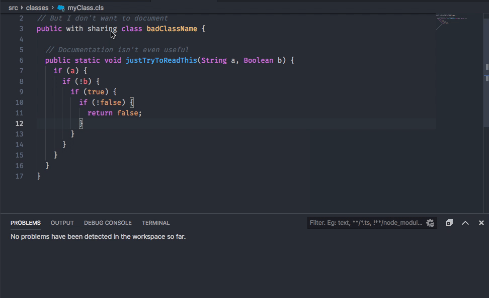

# APLint

A (soon to be) configurable linting tool for Apex and Visualforce code.

## Features

* Lints Apex and Visualforce code on save, from command pallette, editor menu, and touchbar (macOS)
* Generates diagnostic output to both text editor and problems terminal
* Clear diagnostic output in problems terminal from command pallette, editor menue and touchbar (MacOS)
* View rule definition and details from within VSCode or in your default browser (see examples for usage)

## Usage

APLint, by default, lints any Apex or Visualforce page on save. Other commands can be executed using Command-Shift-P (⌘ ⇧ P) or Ctrl-Shift-P on Windows. The currently supported comamnds are:

```
APLint: Run             // runs APLint on the current file without saving
APLint: Clear Problems  // clears all diagnostics from the output console 
```

### Example

How to: Use APLint (with `onSave` linting enabled)



How to: View rule documentation in VSCode


## Configuration

* Add custom ruleset path(s) in `settings.json` using the `aplint.customRulesets` key (see extension settings for more details)

## Rule Categories

* Best Practices: Rules which enforce generally accepted best practices.
* Code Style: Rules which enforce a specific coding style.
* Design: Rules that help you discover design issues.
* Documentation: Rules that are related to code documentation.
* Error Prone: Rules to detect constructs that are either broken, extremely confusing or prone to runtime errors.
* Performance: Rules that flag suboptimal code.
* Security: Rules that flag potential security flaws.

A full index of the above rules can be found [here](https://pmd.github.io/pmd-6.15.0/pmd_rules_apex.html).

## TODO

* Custom action configuration
  * Ability to turn off onSave event
* Custom rule configuration
  * ~~Ability to provide custom ruleset~~
  * Ablity to select from multiple default rulesets
* Warning thresholds
  * Ability to determine which level of severity determines a diagnostic warning, info, etc.
* Point to rule
  * ~~Ability to take user to the rule that triggered the linting error
* Quick actions~~
  * Auto-generate code snipits
  * Suggest fixes for common types of problems as comments

## Built With

* [PMD Source Code Analyzer Project](https://github.com/pmd/pmd)
* [NPM](https://www.npmjs.com/)
* [VSCode Extension API](https://code.visualstudio.com/api)

## Contributing

Please read [CONTRIBUTING.md](CONTRIBUTING.md) for details on our code of conduct, and the process for submitting merge requests to us.

## Versioning

We use [SemVer](http://semver.org/) for versioning. For the versions available, see the [tags on this repository](https://git.platform.manulife.io/SFCore/sf-core-aplint/tags). 

## Authors

* **Gareth Sharpe** - *Initial work* - [@sharpga](https://linkedin.com/in/garethsharpe)

## Acknowledgments

* 
